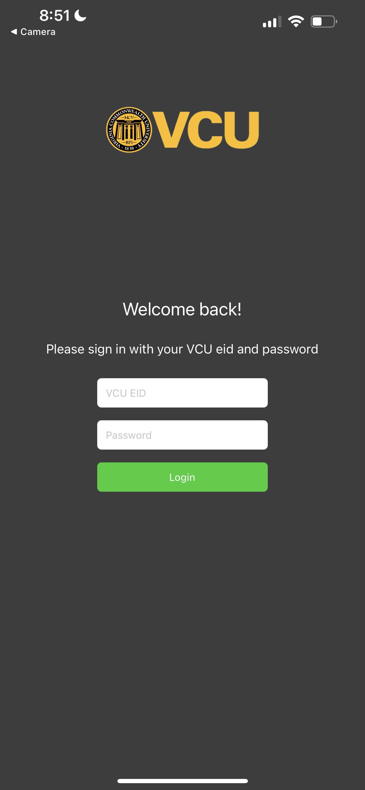

# Class Assistant - A React Native Application (Deprecated)

## Introduction
Introducing Class Assistant, my first venture into UI design created my sophomore year. This React Native application was designed to assist teachers in remembering students' names through various interactive options. Though now deprecated due to library and dependency issues, it remains a proud achievement and an insightful learning experience.

> **Note**: This project is no longer maintained and may have compatibility issues with current libraries and dependencies.

## Table of Contents
- [Features](#features)
- [Design Journey](#design-journey)
- [Challenges and Successes](#challenges-and-successes)
- [Technologies Used](#technologies-used)
- [Legacy and Learnings](#legacy-and-learnings)

## Features
- **Login**: Login with a username and password, currently set to "john123" and "password", however functionality could be expanded to include a database.
- **Class Selection**: Able to select a list of courses that can be pulled from Canvas
- **Name Remembering Options**: Choose between either Alphabetical, or Shuffle mode when ordering students
- **Study Methods**: Chose between either Multiple Choice, or typing in Manually
- **Score Sheet**: Keep track of your score and progress with a score sheet after each quiz, as well as who you got wrong and the correct name for each of them

## Design Journey
Designing this was my first opportunity in my learning career to have real creative control over what I wanted to do, as previously, it was mostly by the book requirements and tasks. When designing this, I knew I wanted a Login page, a Course selection page, as well as an Options page. I also wanted the quiz to feel truly interactive, similar to how Quizlet has their study mode. Finally, it wouldn't be useful if it told you what you did wrong but didnt help you. The final page includes the names of the people you missed, and when you click on them, it shows you their photo alongside their correct name.

## Challenges and Successes
- The main challenge was understanding useState hooks, as I was earlier on in my development career, and had not yet grasped the concept of state and props.
- In the **[students json](students/CMSC312.json)** exists fake and real characters I had in order to test the application, and by the end of developent I had learned the names to all of them -  definitely my biggest success

## Technologies Used
- React Native
- Expo

## Legacy and Learnings
Since this project I have taken on several other UI/UX projects and have learned a lot about the design process. I have also learned a lot about React Native and Expo, and have since moved on to other frameworks such as Flutter and ReactJS. This project was a great learning experience and I am proud of the work I did on it.

---

Thank you for visiting this repository. Feel free to explore the code, design, and appreciate the journey of my first UI creation.
